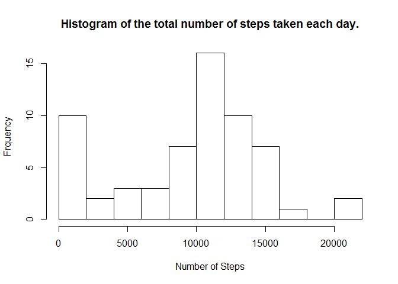
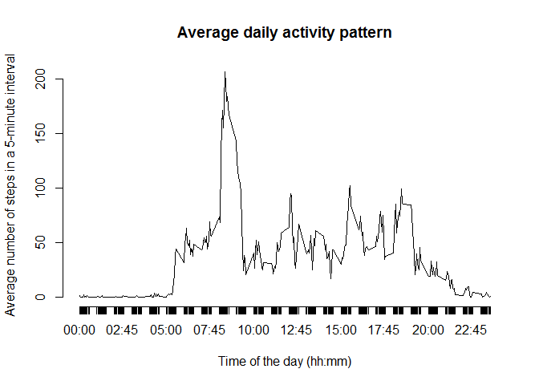
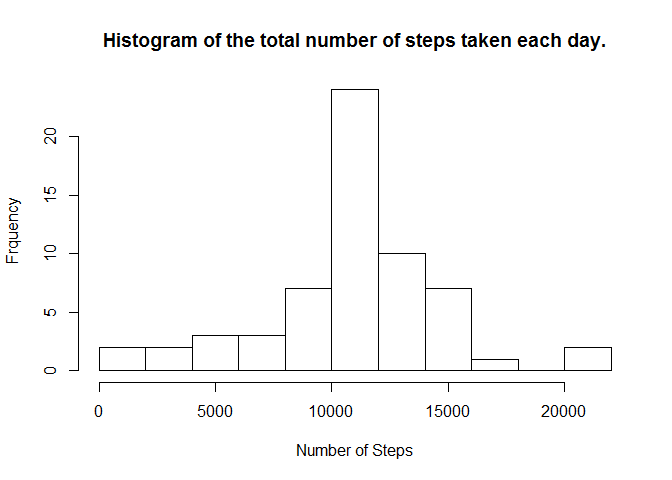

# Course Project 1


### 1 Loading and preprocessing the data

Show any code that is needed to

1. Load the data (i.e. read.csv())
2. Process/transform the data (if necessary) into a format suitable for your analysis


```r
activity <- read.csv("activity.csv", header=TRUE, sep=",")
```

### 2 What is mean total number of steps taken per day?

For this part of the assignment, you can ignore the missing values in the dataset.

1. Calculate the total number of steps taken per day


```r
StepsPerDay <- tapply(activity$steps, activity$date, sum, na.rm = TRUE)
```

2. Make a histogram of the total number of steps taken each day


```r
hist(StepsPerDay, breaks=10, xlab="Number of Steps", ylab="Frquency", main="Histogram of the total number of steps taken each day.")
```



3. Calculate and report the *mean* and *median* of the total number of steps taken per day


```r
mean(StepsPerDay)
```

```
## [1] 9354.23
```

```r
median(StepsPerDay)
```

```
## [1] 10395
```


### 3. What is the average daily activity pattern?

1. Make a time series plot (i.e. type = "l") of the 5-minute interval (x-axis) and the average number of steps taken, averaged across all days (y-axis)

Aggregate the data.


```r
ActivityPattern <- aggregate(steps ~ interval, data = activity, FUN = mean)
```

Create a new column, for use on plot axes.


```r
ActivityPattern$Time <- sprintf("%04d", ActivityPattern$interval)

ActivityPattern$Time <- paste(substr(ActivityPattern$Time, 1, 2), substr(ActivityPattern$Time, 3, 4), sep=":")

head(ActivityPattern)
```

```
##   interval     steps  Time
## 1        0 1.7169811 00:00
## 2        5 0.3396226 00:05
## 3       10 0.1320755 00:10
## 4       15 0.1509434 00:15
## 5       20 0.0754717 00:20
## 6       25 2.0943396 00:25
```

```r
tail(ActivityPattern)
```

```
##     interval     steps  Time
## 283     2330 2.6037736 23:30
## 284     2335 4.6981132 23:35
## 285     2340 3.3018868 23:40
## 286     2345 0.6415094 23:45
## 287     2350 0.2264151 23:50
## 288     2355 1.0754717 23:55
```

Plot data without axes. Add custom axis.


```r
plot(ActivityPattern$interval, ActivityPattern$steps, type="l", axes=FALSE, main="Average daily activity pattern", xlab="Time of the day (hh:mm)", ylab="Average number of steps in a 5-minute interval")

axis(1, at=ActivityPattern$interval, labels=ActivityPattern$Time)
axis(2)
```



2. Which 5-minute interval, on average across all the days in the dataset, contains the maximum number of steps?


```r
max_steps <- subset(ActivityPattern, steps == max(steps))

print(max_steps)
```

```
##     interval    steps  Time
## 104      835 206.1698 08:35
```

Answer: the interval that contains the maximum number of steps is the 104th interval, which starts at 08:35.

### 4. Imputing missing values

Note that there are a number of days/intervals where there are missing values (coded as NA). The presence of missing days may introduce bias into some calculations or summaries of the data.

1. Calculate and report the total number of missing values in the dataset (i.e. the total number of rows with NAs)


```r
sum(is.na(activity))
```

```
## [1] 2304
```

Answer: there are 2304 missing values in the dataset. This is the total number of rows with NAs)

2. Devise a strategy for filling in all of the missing values in the dataset. The strategy does not need to be sophisticated. For example, you could use the mean/median for that day, or the mean for that 5-minute interval, etc.


As suggested, I used the mean for that 5-minute interval (used a for loop to fill NAs values).


3. Create a new dataset that is equal to the original dataset but with the missing data filled in.


```r
activityFilled <- activity 

for (i in 1:nrow(activityFilled)){
  if (is.na(activityFilled$steps[i])){
    activityFilled$steps[i] <- ActivityPattern$steps[which(ActivityPattern$interval == activityFilled$interval[i])]}
}
```

Comparing the original dataset with the new (just headers):


```r
head(activity)
```

```
##   steps       date interval
## 1    NA 2012-10-01        0
## 2    NA 2012-10-01        5
## 3    NA 2012-10-01       10
## 4    NA 2012-10-01       15
## 5    NA 2012-10-01       20
## 6    NA 2012-10-01       25
```

```r
head(activityFilled)
```

```
##       steps       date interval
## 1 1.7169811 2012-10-01        0
## 2 0.3396226 2012-10-01        5
## 3 0.1320755 2012-10-01       10
## 4 0.1509434 2012-10-01       15
## 5 0.0754717 2012-10-01       20
## 6 2.0943396 2012-10-01       25
```

Comparing the original dataset with the new, for NAs:


```r
sum(is.na(activity))
```

```
## [1] 2304
```

```r
sum(is.na(activityFilled))
```

```
## [1] 0
```

4. Make a histogram of the total number of steps taken each day and Calculate and report the mean and median total number of steps taken per day. Do these values differ from the estimates from the first part of the assignment? What is the impact of imputing missing data on the estimates of the total daily number of steps?

I repeated the steps 2.1 thru 2.3, using the new dataset, filled.

The *mean* and *median* values are different from the estimates from the firs part of the assignment (step 2).

Comparing the histograms, I can see that the first frequency interval (first bar on the left / number of steps = 0) has been distributed among the other frequency intervals.


```r
StepsPerDay <- tapply(activityFilled$steps, activityFilled$date, sum, na.rm = TRUE)

hist(StepsPerDay, breaks=10, xlab="Number of Steps", ylab="Frquency", main="Histogram of the total number of steps taken each day.")
```



```r
mean(StepsPerDay)
```

```
## [1] 10766.19
```

```r
median(StepsPerDay)
```

```
## [1] 10766.19
```

### 5. Are there differences in activity patterns between weekdays and weekends?


For this part the weekdays() function may be of some help here. Use the dataset with the filled-in missing values for this part.

1. Create a new factor variable in the dataset with two levels - "weekday" and "weekend" indicating whether a given date is a weekday or weekend day.


I have converted the dates to POSIX format and used the ```wday``` method to get the week day. This method returns an 0-6 integer, starting on Sunday (0), finishing on Saturday(6).


```r
activityFilled$date <- as.POSIXlt(activityFilled$date, format="%Y-%m-%d")

activityFilled$WeekFactor <- ifelse(activityFilled$date$wday %in% 1:5, "weekday", "weekend")
```

This new column ```WeekFactor``` is created as character type, so I convert to a factor variable, as instructed.


```r
activityFilled$WeekFactor <- as.factor(activityFilled$WeekFactor)
```


2. Make a panel plot containing a time series plot (i.e. type = "l") of the 5-minute interval (x-axis) and the average number of steps taken, averaged across all weekday days or weekend days (y-axis). See the README file in the GitHub repository to see an example of what this plot should look like using simulated data.

Again, used the dataset with the filled-in missing values for this part (as instructed).


```r
ActivityPattern <- aggregate(steps ~ interval + WeekFactor, data = activityFilled, FUN = mean)

library(lattice)

xyplot(steps ~ interval | WeekFactor, data=ActivityPattern, type="l", xlab = "Interval", ylab = "Number of steps", layout = c(1, 2))
```


